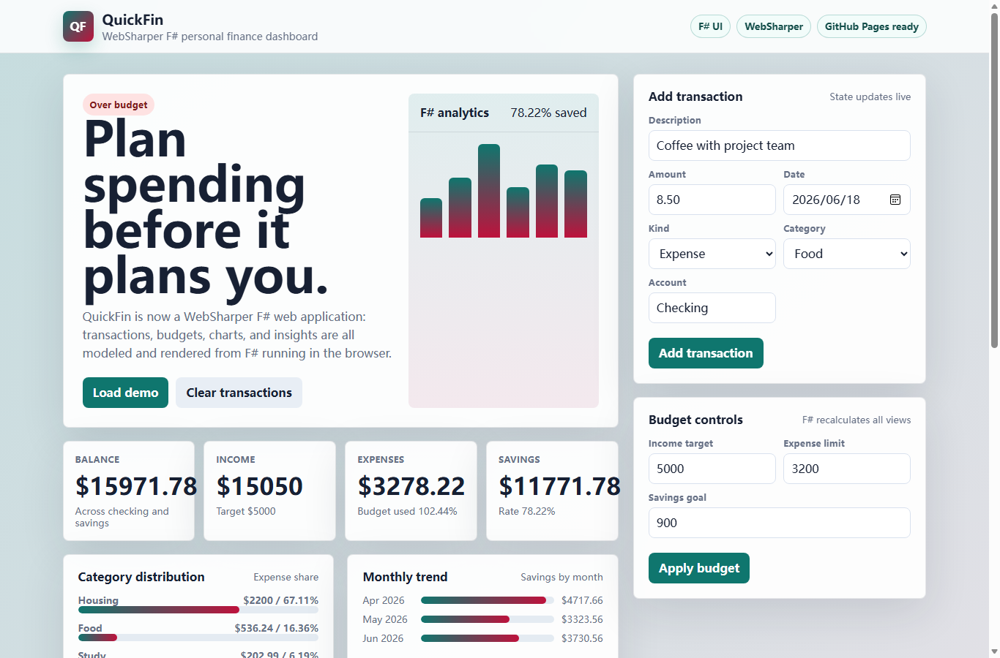

# QuickFin - Personal Finance Planning Dashboard

QuickFin is a client-only personal finance web application for planning a monthly budget, reviewing expenses, and turning transaction history into useful spending insights. The app runs as a static site on GitHub Pages, with the application logic and browser UI authored in F# under `fsharp-src/` and compiled for the browser with WebSharper.

## Motivation

Personal finance tools can be either too simple to be useful or too heavy for everyday planning. QuickFin focuses on a student-friendly workflow: load sample data, add expenses or income, adjust the monthly budget, and immediately see how the dashboard changes.

The project was rebuilt as a WebSharper F# web app so the submitted application demonstrates F# web development directly instead of only using F# for a separate console or backend-style component.

## Features

- Reactive dashboard state with live recomputation.
- First-use guide that points reviewers to the demo data and the main review path.
- Transaction entry with date, account, kind, category, and amount.
- Budget controls for income target, expense limit, and savings goal.
- Summary cards for balance, income, expenses, savings, savings rate, and budget usage.
- Category distribution bars generated from expense data.
- Monthly savings trend calculated from transaction history.
- Smart insights for budget health, savings rate, largest category, largest expense, and recurring expenses.
- In-app feature guide, implementation notes, and generated finance summary for reviewers.
- Responsive WebSharper UI compiled to a static site for GitHub Pages.

For a reviewer-friendly walkthrough of the main flows and F# implementation, see [`FEATURES.md`](FEATURES.md).

## Try Live

https://shaoying888.github.io/QuickFin-Dashboard-1259278462/

## Build and Run

Requirements:

- .NET SDK 8.0 or newer
- Node.js 20 or newer

Build the F# WebSharper site:

```bash
cd fsharp-src
dotnet build QuickFinCore.fsproj -c Release
```

The static site is generated in:

```text
fsharp-src/build/
```

To preview locally after building:

```bash
cd fsharp-src/build
python -m http.server 8080
```

Then open:

```text
http://localhost:8080/
```

## F# Source Structure

| File | Purpose |
|---|---|
| `fsharp-src/Domain.fs` | Domain types, demo data, finance calculations, category analytics, trend generation, and insight rules |
| `fsharp-src/Client.fs` | Browser-side WebSharper UI, reactive state, forms, dashboard rendering, and user interactions |
| `fsharp-src/Main.fs` | WebSharper Sitelet and HTML application entry point |
| `fsharp-src/Main.html` | HTML/CSS template used by WebSharper |
| `fsharp-src/esbuild.config.mjs` | Bundles WebSharper output into the static `all.js` used by GitHub Pages |

## Implementation Notes

QuickFin is delivered as a static web application, but it is not a hand-written JavaScript frontend. WebSharper compiles the F# modules into browser JavaScript, and the generated bundle is what runs on GitHub Pages.

The clearest files to review are:

- `Domain.fs`, for the typed data model and finance calculations.
- `Client.fs`, for the browser UI, reactive state, forms, charts, and event handlers.
- `Main.fs`, for the WebSharper application entry point.

The GitHub Actions workflow builds the F# project in Release mode and deploys the generated `fsharp-src/build/` directory.

## Screenshot



## License

MIT
